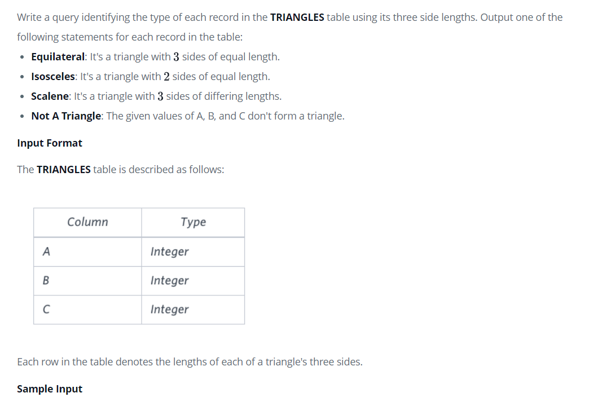
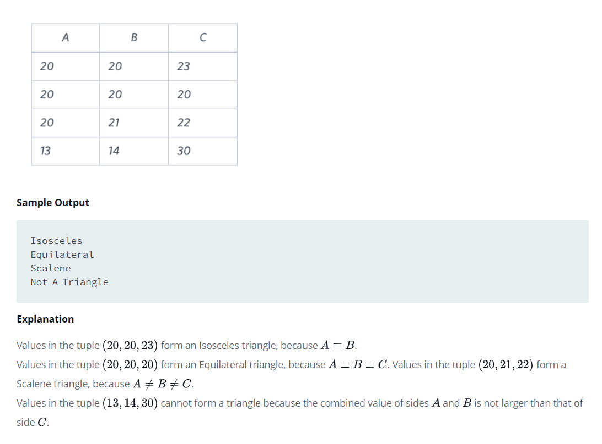
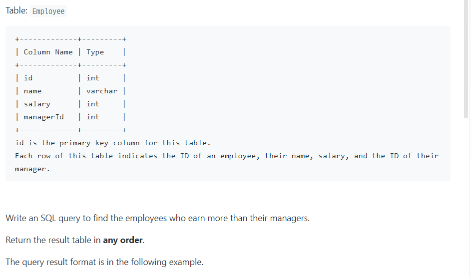
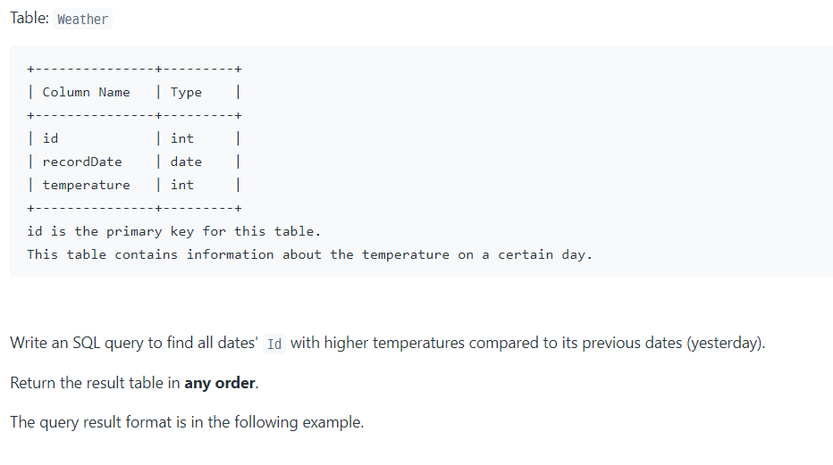
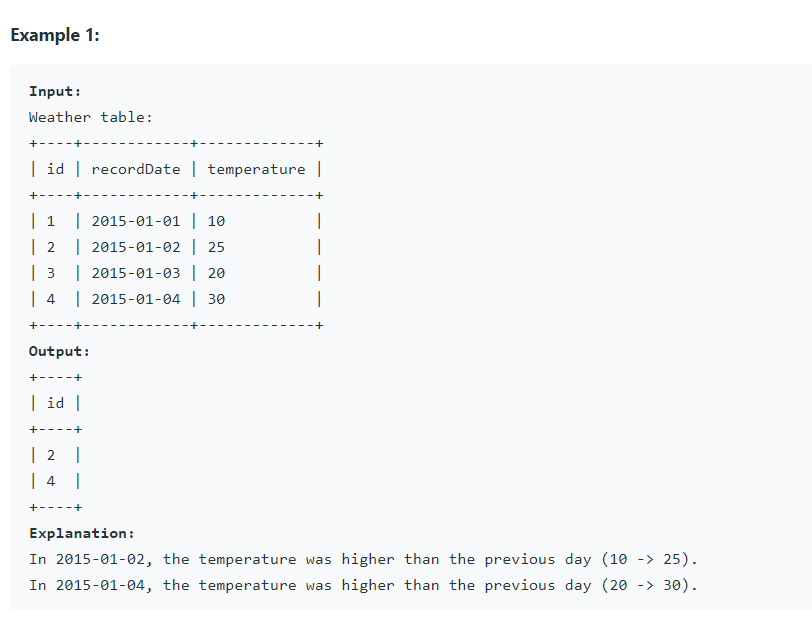
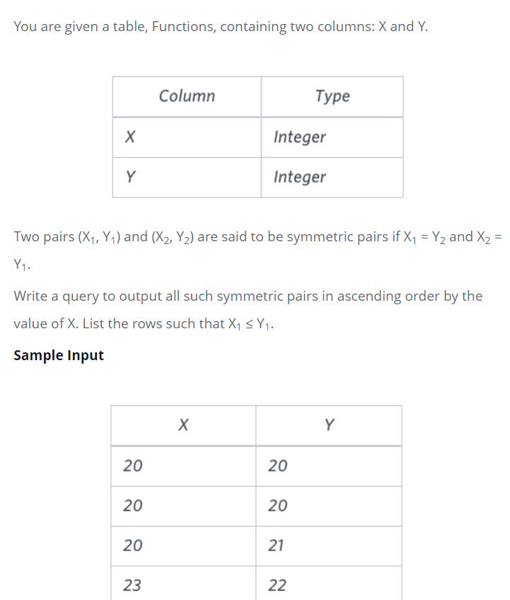
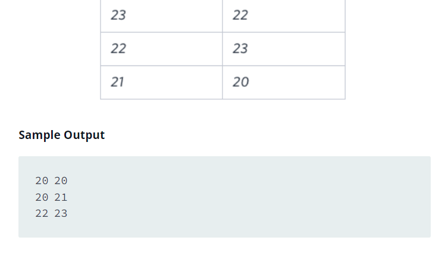

# 프로그래머스 SQL 문제


## 01. IS NULL / IS NOT NULL


```
<오답 작성 쿼리>
SELECT ANIMAIL_ID
FROM ANIMAIL_INS
WHERE NAME = NULL
----------------------------
여기서 잘못된 점은 ANILMAIL_ID = NULL의 의미는 알겠으나, 이건 ANIMAIL_ID 변수에 NULL를 할당한 것임. 문제에서 요구하는 이름없는 동물을 의미하기 위해선 WHERE NAME IS NULL 로 작성해야 한다. * IS NULL 이 하나의 문법이라고 생각하자.

+ 추가

WHERE NAME IS NOT NULL 으로 작성해야 할 때도 있다. 즉, NAME이 NULL이 아닌 경우를 찾고자 하는 조건을 사용할 때이다. 

<정답 쿼리>

SELECT ANIMAIL_ID
FROM ANIMAIL_INS
WHERE NAME IS NULL
```


## 02. DESC


```
<오답 작성 쿼리>
SELECT NAME, DATETIME
FROM ANIMAIL_INS

<정답 쿼리>
SELECT NAME, DATETIME
FROM ANIMAL_INS
ORDER BY ANIMAL_ID DESC

쿼리 문제 풀이 연습과 개념이 아직 명확하게 잡히지 않아서 헷갈림. 실수하지말자.
```


## 03. != or <> 


```
<작성한 정답 쿼리>

SELECT ANIMAL_ID, NAME
FROM ANIMAL_INS
WHERE INTAKE_CONDITION not in ('aged')

----------------------------------------

<다른 정답 쿼리>
SELECT ANIMAL_ID, NAME
FROM ANIMAL_INS
WHERE INTAKE_CONDITION != ('aged')

SELECT ANIMAL_ID, NAME
FROM ANIMAL_INS
WHERE INTAKE_CONDITION <> ('aged')

python 문법 중 아니다를 의미하는 != 를 쿼리에 사용한 것을 확인할 수 있다. 또한 != 이것과 <>은 같은 의미이다.
```


## 04. ORDER BY


```
<오답 작성 쿼리>

SELECT animal_id, name, datetime
from animal_ins
order by name asc

-----------------

<정답 쿼리>

SELECT animal_id, name, datetime
from animal_ins
order by name asc , datetime desc

이름을 기준으로 먼저 오름차순으로 하되, 이름 순서가 같을 경우는 보호일을 기준으로 내림차순으로 하라는 문제 의도는 알았으나, 쿼리로 어떻게 짜야하는지 헷갈렸다. 단순히 order by문법으로 먼저 name을 쓴 것이 1차 정렬 기준이고, 만약 1차 기준이 충돌됐을 경우 뒤에있는 data 정렬이 2차기준인 것을 잊지말자.
```


## 05. HAVING


```
<작성한 정답 쿼리>

SELECT NAME, COUNT(NAME) AS 'COUNT'
FROM ANIMAL_INS
GROUP BY NAME
HAVING COUNT(NAME) >= 2
ORDER BY NAME


GROUP BY 문법을 사용했을 때는 WHERE 문법을 사용하지 못한다. 이때 WHERE 문법과 동일한 기능을 가진 HAVING 문법을 사용하면 된다. HAVING 문법은 항상 GROUP BY절 뒤에 사용해야한다.
```


## 06. IFNULL(A,B)


```
<정답 쿼리>

SELECT ANIMAL_TYPE, IFNULL(NAME,'No name') as NAME , SEX_UPON_INTAKE
FROM ANIMAL_INS
ORDER BY ANIMAl_ID

IFNULL 문법은 다음과 같다.
IFNULL(A,B): A가 NULL이면 B를, 그렇지 않다면 A를 반환한다.
```


## 07. CASE 문법, IF 문법


```
<정답 쿼리 1>

SELECT ANIMAL_ID, NAME, 
CASE
 WHEN SEX_UPON_INTAKE LIKE '%Neutered%' OR SEX_UPON_INTAKE LIKE '%Spayed%'
 THEN 'O'
 ELSE 'X' END as '중성화'
FROM ANIMAL_INS
ORDER BY ANIMAL_ID

<정답 쿼리 2>

SELECT ANIMAL_ID, NAME, IF(SEX_UPON_INTAKE LIKE '%Neutered%' 
                           or 
                           SEX_UPON_INTAKE LIKE '%Spayed%', 'O','X') AS '중성화'
FROM ANIMAL_INS
ORDER BY ANIMAL_ID

------------------------------------
Python 문법 중에 if 문법으로 조건에 맞는 값을 출력하는 것처럼 SQL에서도 CASE와 IF 문법이 있다. Python의 if 문법과 차이점은 or을 하더라도 컬럼명을 다시 적어줘야 한다.

<CASE>
CASE WHEN A THEN B ELSE C END AS '이름' - A에 내가 조건에 해당하는 문장을 넣고, B에 A가 해당된다면 넣어줄 값을, 그렇지 않을 경우는 C값을 넣어주며 END로 닫아준다

<IF>
IF(A B C) AS '이름' - A에 조건을 줄 문장을 넣고, 조건에 해당하는 경우 B값을, 그렇지 않을경우 C값을 할당한다.  
```


## 08. DISTINCT


```
<정답 쿼리>

SELECT COUNT(DISTINCT NAME)
FROM ANIAML_INS
WHERE NAME IS NOT NULL


DISTINCT 문법 익숙해야함.
```


## 09. DATE_FORMAT(A, B)


```
<정답 쿼리> 

SELECT ANIMAL_ID, NAME, DATE_FORMAT(DATETIME, '%Y-%m-%d') AS '날짜'
FROM ANIMAL_INS
ORDER BY ANIMAL_ID
--------------------------

DATETIME의 기본형은 20160-09-23 14:23:00 같은 형식이다. 이 형식을 위와 같은 년도,달,일 순으로만 설정된 것으로 바꾸려면 DATE_FORMAT(A,B) 문법을 사용해야 한다. A에는 바꾸고자 하는 날짜 데이터, B에는 어떤 형식으로 바꿀 지 설정한다. 이때 대소문자 구분에 따라 형식이 바뀔 수 있다. 

EX) '%Y-%M-%D' -> 2019-APRIL-02
EX) '%Y-%m-%d' -> 2019-4-02 
```


## 10. LEFT,RIGHT JOIN


```
JOIN 문법은 아주 중요하다.
LEFT OUTER JOIN / RIGHT OUTER JOIN / INNER JOIN/ FULL OUTER JOIN / EXCLUSIVE JOIN 으로 4가지 JOIN 개념이 있지만, 보통 자주 사용되는 건 LEFT JOIN이다(RIGHT는 LEFT의 테이블 순서만 다른 것 뿐) 

*FULL OUTER JOIN은 MYSQL에서 지원해주는 문법이 따로 없다. 즉 FULL JOIN을 쓰고 싶을 때는 테이블 2개를 짜고, UNION으로 묶어서 표현한다.

LEFT JOIN을 밴다이어그램으로 표현하면 위와 같다. 즉, A라는 테이블의 레코드는 모두 가져오고, A와 B테이블 레코드 중 겹치는 레코드는 A테이블 옆에 붙인다고 생각하면 편하다. 이 때, A레코드는 다 가져오면서, B레코드와 겹치지 않는 레코드가 있는 경우도 발생하며 이때는 NULL값으로 처리된다.

<정답 쿼리>

select outs.animal_id, outs.name 
from animal_outs as outs left outer join animal_ins as ins on outs.animal_id = ins.animal_id 
where ins.animal_id is null
order by outs.animal_id
```


## 11. INNER JOIN(JOIN)


```
INNER JOIN 혹은 JOIN 은 두 테이블에 동시에 있는 것들만 합쳐지는 것이기 때문에 NULL값이 없다.

<정답 쿼리>

SELECT A.ANIMAL_ID, A.NAME
FROM ANIMAL_INS AS A JOIN ANIMAL_OUTS AS B ON A.ANIMAL_ID = B.ANIMAL_ID
ORDER BY B.DATETIME - A.DATETIME DESC
LIMIT 2
```


## 12. 서브쿼리


```
서브쿼리는 python 개념 중 if절 속에 if절이라고 생각하면 쉽다.

<정답 쿼리>

SELECT *
FROM PLACES
where host_id in (select host_id
                 from places
                 group by host_id
                 having count(host_id) >= 2)
order by id
```


# Solvesql 연습 문제


## 01. SUBSTR


```
SUBSTR() 함수는 SUBSTR(문자열, 시작위치, 나타낼 개수)의 문법을 통해 특정 문자열을 잘라주는 기능을 가진다.

EX) SUBSTR('KOREA',1,3) -> 'KOR'

<정답 쿼리 2>

SELECT YEAR, UPPER(LEFT(CITY,3))
FROM GAMES
WHERE YEAR >= 2000
ORDER BY CITY
```


## 02. VARIANCE


```
표본분산을 구할 수 있는 함수로 VARIANCE가 있다.
```


# HACKERRANK


## 01. Type of Triangle(CASE, LOGIC)





```
<오답 작성 쿼리>
select case
           when a = b and a = c then 'Equilateral'
           when a <> b and a <> c and b <> c then 'Scalene'
           when a = b and a <> c then 'Isosceles' 
           when b = c and b <> a then 'Isosceles' 
           when a = c and a <> b then 'Isosceles'
           else 'Not A Triangle'
       end 
from TRIANGLES

------------------------
<정답 작성 쿼리>

SELECT CASE
            WHEN a = b and a = c then 'Equilateral'  --1
            WHEN a + b <= c or a + c <= b or b + c <= a then 'Not A Triangle' --2
            WHEN a = b or b = c or a = c then 'Isosceles' --3
            ELSE 'Scalene' --4
        END 
FROM TRIANGLES


이 문제는 CASE 문법을 활용할 줄 아는 것도 중요하지만 logic이 가장 중요하다. SQL도 PYTHON 처럼 위에서 아래로 읽어 내려간다. PYHTON에서 IF THEN 문법과 마찬가지로 가장 위에 있는 문법에서 충족되면 아래 문법으로 렌더링 하지 않는다. 즉 위의 정답쿼리로 살펴본다면, --3인 이등변 삼각형 조건이 --1 보다 위에 있으면 정삼각형은 --3의 조건도 충족되기 때문에 'Equilateral'이 아닌 'Isosceles'으로 분류된다는 것이다. 

 또한 수학적 사고가 필요한 문제였다. --2가 --3이나 --4와 순서가 뒤바뀐다면 오류가 난다(--1과는 순서가 바뀌어도 상관없다, 오히려 --1위로 보내는 것이 로직상 깔끔해보이기도 한다). 삼각형이 아닌 것들을 먼저 필터링하고, 이후 삼각형 정의에 의해 정삼각형 -> 이등변삼각형 -> 삼각형 순서로 쿼리 조건을 짜면 매우 로직을 짜면 된다.
```


## 02. SELF JOIN



```
<정답 쿼리>

SELECT e.name as Employee
FROM employee as e inner join employee as m on e.managerid = m.id 
where e.salary > m.salary

-----------------------------
SELF JOIN 개념은 말 그대로 하나의 테이블을 똑같이 옆으로 붙여서 원하는 데이터를 뽑아낼 때 사용한다. JOIN을 할 때 가장 중요한 점은 어떤 기준(컬럼)으로 두 테이블을 붙일지 고려해야한다.
```


## 03. DATE_DAA / DATE_SUM






```
<정답 쿼리 작성>

SELECT today.id as id

FROM weather as today join weather as yesterday on date_add(yesterday.recorddate, interval 1 day) = today.recorddate

WHERE today.temperature > yesterday.temperature

---------------------------------

문제에 접근할 때 조심해야 하는 부분을 알려주는 문제이다. ID값을 기준으로 문제에 나온 샘플 데이터를 보면 ID 숫자가 올라갈 수록 DATE 날짜도 하루씩 늘어난다. 이런 점으로 ID값을 기준으로 JOIN을 짜면 테스트 케이스에서 오류가 난다. 즉 문제 출제자는 문제를 푸는 사람이 그런 접근 방식으로 이 문제를 풀기를 바란 게 아니었다. 문제에 보여지는 샘플 데이터만으로 지레 파악하지 말고 꼭 테스트 케이스까지 확인하여 문제에 대한 출제자의 의도를 정확히 파악하는 것이 중요하다.
```


## 04. UNION(위 아래로 합치기)





```
<정답 쿼리>

SELECT x, y
FROM functions
WHERE x = y   ---1
GROUP BY x, y
HAVING count(*) = 2 --2

UNION

SELECT f1.x , f1.y
FROM functions as f1 
    INNER JOIN functions as f2 ON f1.x = f2.y AND f1.y = f2.x --3
WHERE f1.x < f1.y 

ORDER BY X --4

-------------------

굉장히 좋은 문제이다. 한 문제에 GROUP, HAVING, JOIN, UNION 등 많은 개념을 묻는 문제다.
--1은 WHERE 절과 HAVING절을 한 쿼리에 같이 쓸 수 있다는 점을 알 수 있었다. WHERE절을 먼저 썼기 때문에, GROUP BY와 충돌이 일어나지 않고, 이후 HAVING 문법을 사용했기에 추가 조건을 줄 수 있다. --4은 UNION시 두 테이블을 하나로 합친다(옆으로 합치는 게 아니라, 위아래로 합친다) 그 때 합쳐진 데이터가 하나의 새로운 테이블이 되고, 그 테이블에서 X라는 컬럼을 기준으로 정렬을 한다는 의미이다. 따라서, 가장 마지막에 작성한다.
```


