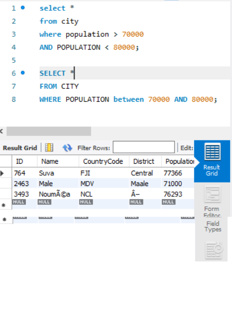

# BASIC_SQL_STUDY


## 01. 테이블, 컬럼 개념


```
쿼리에 SHOW TABLE STATUS; 라고 작성하면
테이블이 나타남. 위 그림에서 테이블은 CITY, COUNTRY, COUNTRYLANG 3가지임.
이 테이블 하부 구조에 각각의 다양한 컬럼(ex. id, name, code 등)이 있는 구조.
```


## 02. Between, AND 



```
두 쿼리는 동일한 결과값을 출력한다.
즉 BETWEEN과 AND 모두 같은 원리이며, 문법 작성에만 조금 차이가 있을 뿐이다.
```


## 03. LIKE , %, _ 개념


```
LIKE : 문자열의 내용 검색하기 위해서 사용. 
_ :문자위에 무엇이든 허용하는 한글자와 매치하기 위해서는 _ 사용. 
%: %는 한 글자가 아니라 뒤에 몇 글자가 와도 무방함.
```


## 04. 서브쿼리


```
SUB QUERY: 쿼리문 안에 또 쿼리문이 있는 것. 서브 쿼리가 둘 이상이 되면 에러가 발생
```


## 05. ANY(=SOME), ALL 개념


```
ANY: 서브쿼리의 여래 개의 결과 중 한가지만 만족해도 가능 (=SOME과 동일)

all: 서브쿼리의 여러 개의 결과를 모두 만족시켜야 함
```


## 06. IN


```
IN: 이산적인 값의 조건에서는 IN 사용가능
```


## 07. ORDER BY, ASCENDING, DESCENDING


```
ORDER BY: 결과가 출력되는 순서를 조절. 기본적으로 오름차순(ASCENDING) / 내림차순은 DESCENDING. 생략할 경우 오름차순이다.
```


## 08. DISTINCT


```
distinct : 중복된 것은 1개씩만 보여주면서 출력, 테이블의 크기가 클수록 효율적이다.
```


## 09. LIMIT


```
LIMIT : 출력개수를 제한.
출력 개수를 제한하지 않으면 엄청난 양의 데이터가 출력됨. 상위 N개 만을 확인할 때 설정
```


## 10. GROUP BY, AS


```
GROUP BY 그룹으로 묶어주는 역할. 집계함수 사용 가능(EX. AVG, MAX, MIN, COUNT ....)
위 쿼리에서 SELECT ~ AS MIN을 사용함. 여기서 AS MIS을 설정해주면서 밑에 표에서 MIN이라고 설정된 것임. 만약 AS MIN을 하지 않았으면 다른 네이밍이 나타남
```


## 11. ROLLUP


```
ROLLUP: 총합 또는 중간합계가 필요할 경우 사용. GROUP BY 절과 함께 WITH ROLLUP문 사용
```


## 12. JOIN


```
JOIN: 데이터베이스 내의 여러 테이블에서 가져온 레코드를 조합하여 하나의 테이블이나 결과 집합으로 표현

주의할 점은 JOIN하고자 하는 테이블의 컬럼이 양쪽 테이블 모두 일치하는 것만 가능하다. 즉 A테이블에 A``라는 컬럼이 있는데, B테이블엔 B``라는 컬럼이 있는 상태에서 A와B는 일치하지 않으니 JOIN을 할 수 없다.
```


## 13. HAVING


```
HAVING : WHERE과 비슷한 개념으로 조건 제한. 집계함수에 대해서 조건 제한하는 개념. 단 이것은 GROUP BY절 뒤에 반드시 나와야 한다.

*추가 학습 내용*

SELECT id , address, name , price
FROM city
WHERE price >= 1000
GROUP BY address

라는 쿼리가 있다고 생각해보자. 위 쿼리는 학습한 내용을 토대로 생각하면 옳지 않은 쿼리다. GROUP 문법을 사용했을 때 WHERE이 아닌 HAVING 문법을 사용해야한다고 배웠었다. 그렇다면 왜? SQL 순서대로 따지면 WHERE절을 사용하면서 가격이 1,000원 이상인 것들로 먼저 조건을 주고 나서 그 조건을 충족한 데이터들 가운데 지역별로 그룹을 나누는 순서가 된다. 
 하지만 지역을 먼저 그룹으로 묶고 이후에 가격이라는 추가적인 조건을 줘야하는 상황이기에 WHERE이 아닌 GROUP 뒤에 HAVING 문법을 사용하는 것이다.
```


## 14. Mysql내장함수

```
LENGTH() : 문자열 길이를 알려줌


CONCAT(): 전달받은 문자열을 합쳐줌. 하나라도 NULL값이 있으면  NULL을 반환

ex) select concat('my', 'name', 'is') => my name is


LOCATE(): 찾는 문자열이 어느 위치에 있는지 알려줌. MySQL에서는 문자열 인덱스가 1부터 시작.

ex) select locate('abc', 'asadadabc') => 7


LEFT(문자열,숫자) RIGHT(문자열,숫자)) : 문자열에서 지정된 숫자만큼 왼쪽에서,오른쪽에서 보여


LOWER(), UPPER() :  문자열을 모두 소문자, 대문자로 바꾸는 것

REPLACE(문자열, 바꾸고 싶은 문자열, 바꿀 문자열) : 문자열에서 특정 문자열을 대체 문자로 교체

ex) replace('my name is hi', 'hi', 'yeo chang') => my name is yeo chang

FORMAT() : 숫자 타입의 데이터를 세자리마다 쉼표를 사용하는 형식으로 변환, 두번 째 인수는 반올림할 부분의 자리 수

ex) format(123123123123.123123123, 6) => 123,123,123,123.123123 

FLOOR() , CEIL(), ROUND() : 올림, 내림, 반올림

NOW(), CURDATE(), CURTIME(): 현재 날짜와 시간, 현재 날짜, 현재 시간을 알려줌. NOW는 CURDATE,TIME 두개를 합친 개념임
```


## 15. create table as select


```
CREATE TABLE (A) AS SELECT * FROM (B);

테이블을 새로 만들 때, 기존에 있던 어떤 테이블을 그대로 복사해서 넣고 싶을 때 사용할 수 있는 구문이다.
```


## 16. CREATE TABLE


```
테이블 만드는 방법 중 하나.
col3에서 varbinary()는 문자열 입력값이고, 최대 몇 자를 입력할 수 있다라는 의미임.
```


## 17. ALTER TABLE


```
만든 테이블을 수정,추가 등 하는 문법.
```


## 18. INDEX설정


```
테이블의 인덱스를 설정하는 방법
```


## 19. INDEX DROP


```
설정한 INDEX를 버리는 방법(DROP)
```


## 20. INSERT INTO


```
만든 테이블에 VALUE를 입력할 때 INSERT IN 테이블 문법을 사용한다.
이 때 주의할 점은 넣을 값의 종류와 갯수가 이미 테이블에서 설정한 컬럼과 갯수와 동일해야 한다.
```


## 21. UPDATA


```
기존 테이블의 업데이트 문법. 주의할 점은 UPDATE와 SET은 하나의 세트! 또한 업데이트 할 id값을 반드시 명시해야함. 그렇지 않으면 데이터 전체가 다 바뀌어 버림.
```


## 22. DELETE


```
DELETE 문법도 UPDATE처럼 삭제할 id값을 명시해야 함. 명시하지 않을 경우 데이터 전체가 사라짐
```


